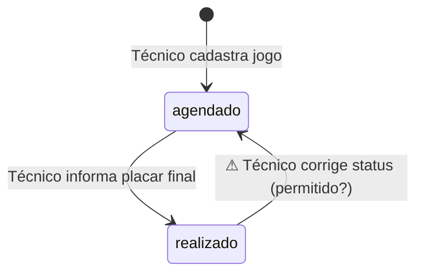

# Formatos dos artefatos do grilling

## `CONTEXT.md` (raiz)

```markdown
# Contexto do domínio: Ultimate Basketball

Atualizado em AAAA-MM-DD. Fonte de verdade do vocabulário. Código, issues e ADRs usam
estes termos.

## Glossário

### Categoria (`teams`)
Definição em uma ou duas frases. Regras-chave (com link para ADR quando houver).
Não confundir com: <termo vizinho>.

### ...

## A definir

| # | Pergunta | Default provisório | Origem |
|---|---|---|---|
| P-01 | ... ? | ... ⚠ confirmar | `<arquivo>:<linha>` ou tela do protótipo |
```

Regras: um termo por `###`, ordem alfabética; nome técnico entre parênteses quando difere
do termo de domínio; pendência resolvida sai de "A definir" e vira ADR ou texto do glossário
(com a data da decisão).

## ADR (`docs/adr/NNNN-<slug>.md`)

```markdown
# NNNN. <Título no imperativo curto>

- Status: aceita | proposta (⚠ confirmar) | substituída por NNNN
- Data: AAAA-MM-DD
- Fontes: <arquivos/telas que motivaram>

## Contexto
O que estava em conflito ou indefinido.

## Decisão
O que vale. Se havia divergência entre fontes, qual venceu e por quê.

## Consequências
O que muda no código/dados; o que fica proibido; o que precisa de migração.
```

ADR derivada sem confirmação do usuário nasce `proposta (⚠ confirmar)` e tem a pergunta
correspondente em "A definir".

## Modelo de estados (`docs/dominio/estados-<entidade>.mmd`)



Toda transição: `origem --> destino: <Ator> <ação/condição>`. Transição sem confirmação
leva ⚠ no rótulo.
